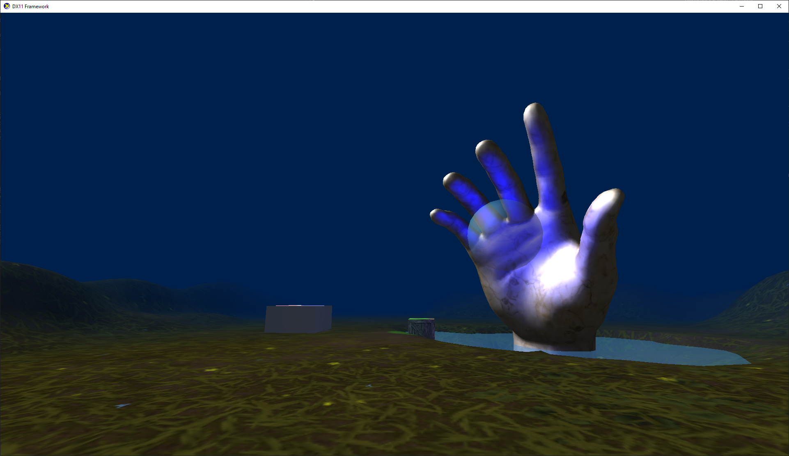

# DirectX 11 Rendering Engine

A University project done over the course of Semester 1, 2022.

## What is it?

This small application is a project developed for university that involves learning how the DirectX 11 render pipeline works and how to implement various lighting techniques.

Specifically, the following featuers have been implemented:

- Reading from YAML to add materials, cameras, scenery, and other settings without recompiling.
- Phong shading, including ambient, diffuse, and specular lighting.
- Materials include albedo and specular map textures with lighting interaction.
- Point and Directional lights that use Phong shading, configurable via YAML.
- A free camera and normal camera, switchable using the number keys.
- Pixel colour blending for translucent objects

I am currently working on skyboxes, and potentially even basic heightmap terrain generation if time permits.

## Credits

- [yaml-cpp](https://github.com/jbeder/yaml-cpp) by Jesse Beder
- [Patchy Medow](https://freepbr.com/materials/patchy-meadow/) texture by freepbr.com
- [Hand Sculpture](https://skfb.ly/oxY6x) by re1monsen is licensed under [Creative Commons Attribution](http://creativecommons.org/licenses/by/4.0/)
- Base framework provided by the university, as seen in the first commit.

